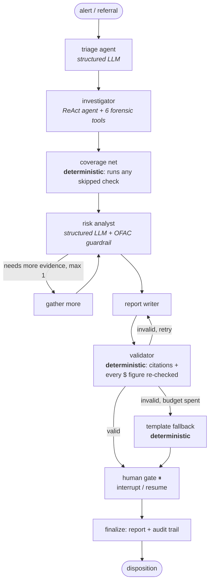

# Agentic AML Investigator

**A multi-agent anti-money-laundering investigation copilot that runs entirely on a laptop.**
LangGraph agents over a DuckDB transaction warehouse investigate suspicious-activity alerts end-to-end — triage, forensic tool use, OFAC sanctions screening, risk assessment, SAR-style reporting, and a human-in-the-loop approval gate — powered by local Ollama models on 8 GB of VRAM, with **zero API keys** and an evaluation harness that scores the agents' decisions against labeled ground truth.




**Design thesis — "the agent proposes, the machinery guarantees":** every LLM step is paired with a deterministic safety mechanism, so a flaky 8B model can degrade *quality* but cannot crash the pipeline, skip a sanctions screen, or fabricate an evidence number that survives validation.

## Results Summary

18 labeled cases (10 injected AML typologies + 8 hard-negative/clean accounts), human gate auto-approved, two evaluation rounds (`v1` = as first built, `v2` = after eval-driven fixes):

| Backbone | Accuracy | Precision | Recall | F1 | Typology top-1 | p50 / case |
|---|---|---|---|---|---|---|
| granite4.1:8b v1 | 0.50 | 0.55 | 0.60 | 0.571 | 1.00 | 30 s |
| **granite4.1:8b v2** | **0.67** | **0.64** | **0.90** | **0.75** | **1.00** | **34 s** |
| qwen3.5:9b v1 | 0.44 | 0.50 | 0.50 | 0.50 | 0.80 | 326 s |
| qwen3.5:9b v2 | 0.61 | 0.80 | 0.40 | 0.533 | 1.00 | 372 s |

Report **groundedness 1.00 / 0.98** (share of dollar figures in generated reports that trace to stored evidence — checked deterministically, not by an LLM). Full tables, confusion matrices, and the per-case error analysis are in [notebook 04](notebooks/04_evaluation.ipynb).

## Contents

- [Why this project](#why-this-project)
- [What's inside](#whats-inside)
- [The evaluation-driven iteration (v1 → v2)](#the-evaluation-driven-iteration-v1--v2)
- [Results in full](#results-in-full)
- [The notebooks](#the-notebooks)
- [Data](#data)
- [Setup](#setup)
- [Project structure](#project-structure)
- [Implementation notes & gotchas](#implementation-notes--gotchas)
- [Limitations](#limitations)
- [Roadmap (v3)](#roadmap-v3)
- [License & acknowledgements](#license--acknowledgements)

## Why this project

Fraud/AML portfolios usually stop at **detection** — a model emits a score and the story ends. In real compliance teams that's where the work *starts*: someone must investigate the alert, screen sanctions, weigh the evidence, write a defensible report, and route it through human approval. This project builds that **investigation layer** as a reliability-engineered multi-agent system, and — unusually for agent demos — **measures its decisions against ground truth** instead of showing one cherry-picked transcript.

It also answers a practical question: *how far can agentic systems go on strictly local models?* Everything here runs on one consumer laptop GPU. No OpenAI/Anthropic keys, no cloud.

## What's inside

- **Five deterministic forensic tools + guarded ad-hoc SQL** — structuring scan, velocity scan, counterparty-network/ring detection (recursive SQL), fuzzy OFAC sanctions screening (rapidfuzz over the **real** 19k-entry SDN list), KYC profiling, and a `run_sql` tool fenced by a sqlglot-based guard (SELECT-only, table allowlist, auto-LIMIT — the eval labels are unqueryable, so agents can't cheat).
- **Evidence store with state compression** — tools persist full payloads to DuckDB keyed `[EV-xx]`; the model's context only ever sees compact summaries. The model cannot fabricate evidence rows, and the stored payloads are what reports are validated against.
- **A hardened structured-output path** — every structured LLM decision goes through one escalation ladder: `function_calling` → grammar-constrained `json_schema` (+ error feedback) → deterministic fallback, with a request timeout. Measured, not assumed (notebook 02 benchmarks both methods on both backbones).
- **Human-in-the-loop + durable persistence** — `interrupt()` at the approval gate, SQLite-backed checkpoints, demonstrated **kill-and-resume** (destroy every Python object, rebuild from the checkpoint file, resume the paused case), human override with an audit trail.
- **A three-layer evaluation harness** — decision quality vs ground truth, process reliability from telemetry (tool error rates, retries, coverage-net activations, latency, tokens), and report quality (deterministic groundedness + cross-family LLM judge: granite judges qwen's reports and vice versa, damping self-preference).

## The evaluation-driven iteration (v1 → v2)

Round 1 scored the system as first built — and it was mediocre (granite F1 0.571). The eval made the failures *diagnosable*:

1. **Every ring/funnel case was dismissed with only 2 tool calls.** Those accounts produce no rule alerts (rules can't see networks), entered as manual referrals, and triage picked minimal checks — the network scan never ran. **Fix (policy, deterministic):** manual referrals are full-scope by definition; the coverage net now guarantees all five checks.
2. **Hard negatives were escalated.** The analyst anchored on "22 in-band cash deposits" while ignoring the exonerating signal in the same evidence (dozens of deposits *over* $10k — real structurers never cross the threshold). **Fix (doctrine, prompt):** standard AML doctrine added to the risk prompt (threshold-crossing exonerates; payroll recurs monthly; weigh ring amounts vs graph noise).

Neither fix references evaluation labels. Round 2 re-ran everything: granite recall jumped **0.60 → 0.90** (every ring + both sanctions evaders now caught; F1 0.75), while qwen became conservative (precision 0.80, recall 0.40) — making the backbone choice an explicit, measured trade-off. Both rounds' raw results are preserved in [`artifacts/eval/`](artifacts/eval/).

## Results in full

**Decision quality** (vs labeled ground truth, n=18 per run): see TL;DR table above, plus:

| | granite v2 | qwen v2 |
|---|---|---|
| Sanctions recall (fuzzy SDN evaders caught *and* escalated) | **1.00** | 0.50 |
| Mean risk score: suspicious vs clean | 63 vs 54 | 45 vs 31 |

**Process reliability** (round 2, from per-case telemetry):

| | granite4.1:8b | qwen3.5:9b |
|---|---|---|
| Wall-clock p50 / p95 per case | 34 s / 45 s | 372 s / 581 s |
| LLM calls / tokens per case | 5.9 / ~5.6k | 5.7 / ~12.7k |
| Tool-call error rate | 0.05 | 0.21 |
| Structured-output retry rate | 0.11 | 0.28 |
| Structured-output fallback rate | **0.00** | **0.00** |
| Coverage-net activation rate | 0.89* | 0.78* |
| Template-fallback report rate | 0.00 | 0.06 |
| Report groundedness (deterministic) | **1.00** | 0.98 |

\* In v2 the full-scope policy intentionally routes manual-referral checks through the coverage net, so activation is partly policy, not flakiness.

**Report quality (cross-family LLM judge, round 2)** — granite's reports judged by qwen and vice versa, 1–5 rubric (1 = poor, 5 = excellent):

| | granite4.1:8b reports<br/>(judged by qwen3.5:9b) | qwen3.5:9b reports<br/>(judged by granite4.1:8b) |
|---|---|---|
| Groundedness | 3.2 | **5.0** |
| Completeness | 3.9 | **4.1** |
| Clarity | **4.0** | 4.6 |

Note: qwen's reports score higher on groundedness and clarity (it tends toward explicit citation and structured prose), while granite's reports are more concise but occasionally under-cite. Both are readable by a compliance officer; the deterministic groundedness checker (which literally re-checks every dollar figure against stored evidence) is the more reliable signal.

## The notebooks

Tutorial-style, executed top-to-bottom for real — every output, chart, and number in them came from an actual run (the committed `.ipynb` files include the outputs):

| Notebook | What it teaches | Highlight |
|---|---|---|
| [01 — Data Foundation](notebooks/01_data_foundation.ipynb) | Agents need a data layer, not a CSV | The rule-coverage gap: 3 of 5 typologies produce **zero** rule alerts — that gap is the agent's job |
| [02 — Tools & Reliability](notebooks/02_tools_and_reliability.ipynb) | Tool design is 80% of local-agent reliability | Live benchmark of structured-output methods; a real Ollama gotcha (`think:false` silently disables constrained decoding) |
| [03 — The Investigation Graph](notebooks/03_investigation_graph.ipynb) | Assembling the multi-agent system | The validator catches the model inventing dollar figures *live*; kill-and-resume from the checkpoint file; human override |
| [04 — Evaluation](notebooks/04_evaluation.ipynb) | Evaluating agent *behaviour*, not vibes | Two full eval rounds: v1 → diagnosis → fixes → v2, all numbers real |

Notebooks are generated from [`scripts/build_notebooks.py`](scripts/build_notebooks.py) (edit the builder, re-execute — keeps source and outputs in sync).

## Data

- **Transactions:** a seeded synthetic ledger (`seed=42`, ~200 accounts, ~35k transactions, 90 days) with **five injected AML typologies** recorded in a hidden `ground_truth` table: structuring, velocity burst, circular transfers, funnel account, sanctioned counterparty — plus deliberately alert-looking *clean* hard negatives (cash-intensive businesses, payroll runs). Why synthetic: real AML case data is never public, and PaySim contains a single fraud pattern (every investigation would look identical). The generator regenerates byte-identically on any machine, and labels make the evaluation quantitative.
- **Sanctions:** the **real OFAC SDN list** (~19k entities, keyless download from treasury.gov, snapshot committed for reproducibility). Sanctioned-counterparty cases use planted one-character variants of real SDN names — realistic evasion that exact matching misses and fuzzy matching catches (scores 94–96), alongside genuine organic near-miss false positives.

## Setup

Prereqs: [uv](https://docs.astral.sh/uv/), [Ollama](https://ollama.com) running locally, ~8 GB VRAM.

```bash
git clone https://github.com/pypi-ahmad/agentic-aml-investigator.git
cd agentic-aml-investigator
uv sync

ollama pull granite4.1:8b   # default backbone
ollama pull qwen3.5:9b      # A/B challenger + cross-family judge

uv run pytest -q            # 29 unit tests, no LLM needed
uv run jupyter lab          # then run notebooks/01 → 04 in order
```

Configuration is environment-driven (see [`src/aml_investigator/settings.py`](src/aml_investigator/settings.py)), e.g. swap the backbone with `AML_AGENT_MODEL=qwen3.5:9b`.

## Project structure

```
├── notebooks/                  # the tutorial (executed, real outputs)
├── scripts/build_notebooks.py  # notebook source of truth
├── src/aml_investigator/
│   ├── graph/build.py          # StateGraph: nodes, edges, interrupt, guardrails
│   ├── tools/forensics.py      # 5 forensic tools + evidence store
│   ├── tools/sql_guard.py      # sqlglot SELECT-only guard (anti-cheating)
│   ├── llm.py                  # structured-output escalation ladder + timeout
│   ├── prompts.py              # one focused system prompt per agent role
│   ├── data/generator.py       # seeded ledger + typology injection
│   ├── data/ofac.py            # real OFAC SDN download/cache
│   ├── evaluation/             # cases, runner (resumable), metrics, judge
│   ├── telemetry.py            # per-case LLM/tool latency + token capture
│   └── schemas.py / settings.py / db.py / reporting.py
├── tests/                      # 29 pytest tests (SQL guard, generator, validator, ladder)
├── artifacts/                  # eval JSONL/CSV, generated reports, figures
└── data/raw/sdn.csv            # committed OFAC snapshot (public domain)
```

## Implementation notes & gotchas

Hard-won, all reproduced in the notebooks:

- **Ollama 0.30.x + thinking models: `think:false` silently disables `format=` constrained decoding.** With thinking left on, thinking goes to a separate field and the content is grammar-constrained. Demonstrated live in notebook 02.
- **Grammar-constrained decoding fixes syntax, not semantics** — without `maxItems` + prompt guidance, an 8B model degenerates into repeated enum values inside a perfectly valid JSON array.
- **`SqliteSaver` in Jupyter:** build it over a long-lived `sqlite3.connect(..., check_same_thread=False)`; the context-manager form closes the DB at cell end and fights notebook execution.
- **Always set a request timeout on local inference.** A hung generation otherwise blocks an unattended pipeline indefinitely; with the escalation ladder, a timeout just becomes a fallback.
- **LangGraph may run nodes/tools in worker threads** — `ContextVar` state set in one node doesn't reliably reach tools; for strictly sequential cases, module-level state is the honest fix.
- **Cross-family judging:** have granite judge qwen's reports and vice versa; same-family judging inflates scores.

## Limitations

Stated plainly, also discussed in notebook 04:

- **n=18 cases, 1–3 per typology** — enough to find and fix systematic failures, not for tight confidence intervals.
- **One iteration round against a fixed eval set** risks prompt-overfitting; a real programme would hold out fresh typology instances (see Roadmap).
- **Synthetic, textbook-shaped typologies**; real laundering is adversarial. The OFAC list is real, but planted variants encode one evasion style.
- **Remaining known failures:** cash-intensive-business hard negatives still over-escalate (the analyst under-weights exonerating evidence), and the funnel case is under-detected — both traced to evidence *presentation*, with concrete v3 fixes below.
- **The LLM judge is a 9B model with a rubric** — a secondary signal beside the deterministic groundedness checker.
- Auto-approving the human gate measures the *system's* recommendations; whether humans catch system mistakes is a user study, not a notebook.

## Roadmap (v3)

- Tools should interpret, not just count: report the **in-band share** of cash deposits (structurers ≈ 100%, legit cash businesses ≪) and sender/receiver concentration ratios (funnel detection), so the analyst sees the discriminative ratio directly.
- Held-out eval generation: fresh typology instances from unseen seeds to measure (and prevent) iteration overfitting.
- Risk-score calibration against escalate/dismiss outcomes; ROC over the 0–100 score.
- `PostgresSaver` + a thin case-queue UI for a multi-investigator deployment story.

## License & acknowledgements

[MIT](LICENSE). The SDN list is published by the [U.S. Treasury OFAC](https://ofac.treasury.gov/) (public domain). Built with [LangGraph](https://github.com/langchain-ai/langgraph), [Ollama](https://ollama.com), [DuckDB](https://duckdb.org), [sqlglot](https://github.com/tobymao/sqlglot), and [rapidfuzz](https://github.com/rapidfuzz/RapidFuzz).

> Part of a portfolio exploring the full risk lifecycle: [temporal-graph AML detection](https://github.com/pypi-ahmad), payment-fraud scoring, complaint triage (QLoRA), production RAG — this project adds the **investigation** layer on top of detection.
