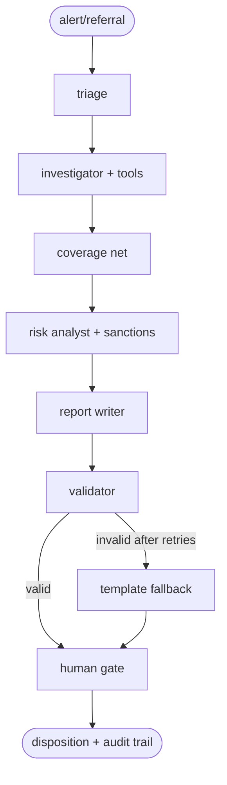

# Agentic AML Investigator

**A local, multi-agent anti-money-laundering investigation copilot.**

LangGraph agents over a DuckDB transaction warehouse investigate suspicious-activity alerts end-to-end: triage, forensic tooling, sanctions screening, risk assessment, report drafting, validation, and human approval.


## Quickstart

Prerequisites:

- [uv](https://docs.astral.sh/uv/)
- [Ollama](https://ollama.com) running locally
- Roughly 8 GB VRAM for the default local models

```bash
git clone https://github.com/pypi-ahmad/agentic-aml-investigator.git
cd agentic-aml-investigator
uv sync

ollama pull granite4.1:8b
ollama pull qwen3.5:9b

uv run jupyter lab
```

Run notebooks in order: `notebooks/01_*` to `notebooks/04_*`.

Optional:

```bash
# Rebuild notebook files from the Python builder script
uv run python scripts/build_notebooks.py all

# Switch model backbone for local runs
AML_AGENT_MODEL=qwen3.5:9b uv run jupyter lab
```

## What It Does

The pipeline is built as a reliability-oriented investigation system:

1. **Triage** incoming alerts/referrals.
2. **Investigate** with deterministic forensic tools and guarded ad-hoc SQL.
3. **Guarantee coverage** with a deterministic coverage-net pass.
4. **Score risk** with sanctions-aware analysis.
5. **Draft + validate reports** with citation and amount checks.
6. **Pause for human decision** with interrupt/resume support and audit trail.

## System Architecture



Design principle: deterministic checks enforce safety and consistency around model outputs, so local-model variance affects quality more than control-flow correctness.

## Results Snapshot

Two measured local backbones (`granite4.1:8b`, `qwen3.5:9b`) were run across labeled AML scenarios in two rounds (`v1`, `v2`), with improvements driven by evaluation findings.

- `granite4.1:8b` improved from `F1 0.571` to `F1 0.75`.
- `qwen3.5:9b` improved from `F1 0.50` to `F1 0.533` with higher precision/lower recall behavior.
- Deterministic report-groundedness checks remained high (`1.00` / `0.98` in round 2 by backbone).

For full metrics, confusion matrices, and per-case analysis:

- [notebooks/04_evaluation.ipynb](notebooks/04_evaluation.ipynb)
- [artifacts/eval/](artifacts/eval/)

## Notebooks

- [01_data_foundation.ipynb](notebooks/01_data_foundation.ipynb): synthetic ledger + AML typologies
- [02_tools_and_reliability.ipynb](notebooks/02_tools_and_reliability.ipynb): tooling and structured-output reliability
- [03_investigation_graph.ipynb](notebooks/03_investigation_graph.ipynb): graph assembly, validation, and interrupt/resume flow
- [04_evaluation.ipynb](notebooks/04_evaluation.ipynb): evaluation runs and iteration outcomes

Notebook files are generated from [scripts/build_notebooks.py](scripts/build_notebooks.py).

## Data

- Synthetic transaction warehouse: seeded, reproducible ledger with injected AML typologies and clean hard negatives.
- Sanctions dataset: committed OFAC SDN snapshot in [data/raw/sdn.csv](data/raw/sdn.csv).
- Evaluation outputs and generated reports: [artifacts/](artifacts/).

## Project Structure

```text
agentic-aml-investigator/
├── notebooks/
├── scripts/build_notebooks.py
├── src/aml_investigator/
│   ├── graph/
│   ├── tools/
│   ├── evaluation/
│   ├── llm.py
│   ├── telemetry.py
│   ├── reporting.py
│   ├── schemas.py
│   ├── settings.py
│   └── db.py
├── data/raw/sdn.csv
├── artifacts/
├── pyproject.toml
├── uv.lock
└── README.md
```

## Limitations

1. Evaluation scale is small relative to production AML variability.
2. Synthetic typologies cannot fully capture adversarial real-world laundering behavior.
3. Local-model outputs can vary by backbone and prompt sensitivity.
4. Human-gate behavior is demonstrated operationally but not studied as a formal user experiment.

## Roadmap

1. Expand held-out scenario generation across unseen seeds and typology variants.
2. Improve tool outputs to surface stronger discriminative ratios for analysts.
3. Calibrate risk score thresholds against escalate/dismiss outcomes.
4. Add multi-investigator workflow support over a shared persistent backend.

## License

[MIT](LICENSE)

## Acknowledgements

Built with [LangGraph](https://github.com/langchain-ai/langgraph), [Ollama](https://ollama.com), [DuckDB](https://duckdb.org), [sqlglot](https://github.com/tobymao/sqlglot), and [rapidfuzz](https://github.com/rapidfuzz/RapidFuzz).
